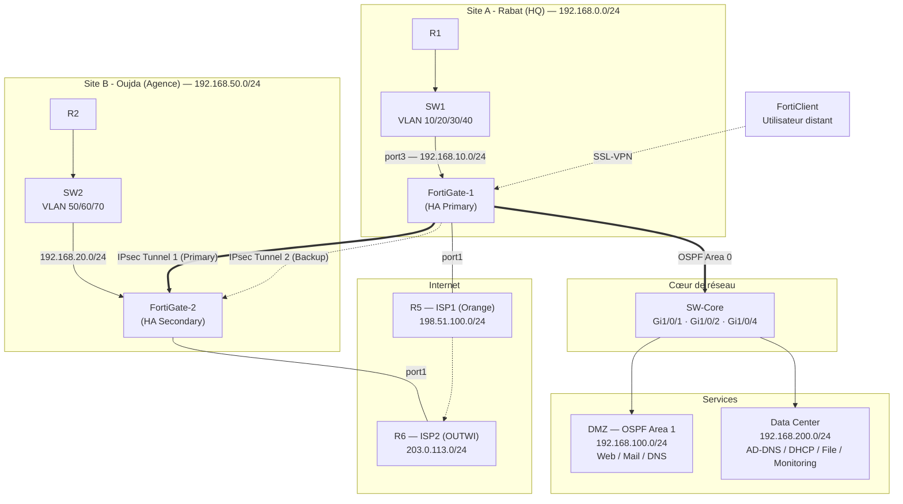

# Multi-Site-Network
# 🌐 Infrastructure Réseau d'Entreprise Multi-Sites — Résiliente & Sécurisée

**Lab GNS3** — Rabat (HQ) ↔ Oujda (Agence) | Double ISP | SD-WAN | IPsec redondant | OSPF Multi-Area | FortiGate HA

---

## 📑 Sommaire

1. [Présentation](#-présentation)
2. [Schéma d'architecture](#-schéma-darchitecture)
3. [Topologie détaillée](#-topologie-détaillée)
4. [Plan d'adressage IP](#-plan-dadressage-ip)
5. [VLANs et Trunking](#-vlans-et-trunking)
6. [Routage OSPF Multi-Area](#-routage-ospf-multi-area)
7. [SD-WAN (double ISP)](#-sd-wan-double-isp)
8. [VPN IPsec Site-to-Site](#-vpn-ipsec-site-to-site)
9. [Accès distant SSL-VPN](#-accès-distant-ssl-vpn)
10. [Vérifications réalisées (captures CLI)](#-vérifications-réalisées-captures-cli)
11. [Scénarios de panne testés](#-scénarios-de-panne-testés)
12. [Mise en place dans GNS3](#-mise-en-place-dans-gns3)
13. [Compétences & Technologies](#-compétences--technologies)
14. [Pistes d'amélioration](#-pistes-damélioration)

---

## 📌 Présentation

Ce projet simule, sous GNS3, une infrastructure d'entreprise reliant deux sites — **Rabat (siège)** et **Oujda (agence)** — via deux fournisseurs d'accès Internet redondants (**Orange** et **OUTWI**), deux tunnels **IPsec Site-to-Site**, un cœur de réseau routé en **OSPF Multi-Area**, une paire de **FortiGate en haute disponibilité (HA)**, une **DMZ**, un **Data Center** de services, et un accès **SSL-VPN** pour le télétravail.

---

## 🏗️ Schéma d'architecture



---

## 🖧 Topologie détaillée

| Élément | Détail |
|---|---|
| **Site A – Rabat (HQ)** | R1 → SW1 (VLANs 10/20/30/40) → FortiGate-1 (HA Primary) |
| **Site B – Oujda (Agence)** | R2 → SW2 (VLANs 50/60/70) → FortiGate-2 (HA Secondary) |
| **ISP1 (Orange)** | R5 — réseau 198.51.100.0/24 |
| **ISP2 (OUTWI)** | R6 — réseau 203.0.113.0/24 |
| **Cœur de réseau** | SW-Core (interfaces Gi1/0/1, Gi1/0/2, Gi1/0/4) reliant DMZ, Data Center et les deux FortiGate |
| **DMZ** | SW3 — Web Server, Mail Server, DNS Server (OSPF Area 1) |
| **Data Center** | SW4 — AD/DNS, DHCP, File Server, Monitoring |
| **Accès télétravail** | FortiClient (SSL-VPN) via Internet vers FortiGate-1 |

---

## 📋 Plan d'adressage IP

### Sites

| Site | Réseau global (schéma) | Équipements |
|---|---|---|
| Site A – Rabat (HQ) | 192.168.0.0/24 | R1, SW1, FortiGate-1 |
| Site B – Oujda (Agence) | 192.168.50.0/24 | R2, SW2, FortiGate-2 |

### VLANs — Site A (Rabat)

| VLAN | Nom | Réseau | Poste |
|---|---|---|---|
| 10 | Administration | 192.168.10.0/24 | PC1 |
| 20 | IT / Engineering | 192.168.20.0/24 | PC2 |
| 30 | Finance | 192.168.30.0/24 | PC3 |
| 40 | Comptabilité | 192.168.40.0/24 | PC4 |

### VLANs — Site B (Oujda)

| VLAN | Nom | Réseau | Poste |
|---|---|---|---|
| 50 | Commercial | 192.168.50.0/24 | PC5 |
| 60 | Production | 192.168.60.0/24 | PC6 |
| 70 | Management | 192.168.70.0/24 | PC7 |

### Liens et services

| Segment | Réseau | Détail |
|---|---|---|
| ISP1 (Orange) | 198.51.100.0/24 | R5 — port1 FortiGate-1 (gateway .1) |
| ISP2 (OUTWI) | 203.0.113.0/24 | R6 — port1 FortiGate-2 (gateway .1) |
| SW1 ↔ FortiGate-1 (port3) | 192.168.10.0/24 | Uplink Site A |
| SW2 ↔ FortiGate-2 (port3) | 192.168.20.0/24 | Uplink Site B |
| SW-Core ↔ DMZ | 192.168.100.0/24 | OSPF Area 1 |
| SW-Core ↔ Data Center | 192.168.200.0/24 | — |
| DMZ — Web Server | 192.168.100.10 | Service public |
| DMZ — Mail Server | 192.168.100.20 | Service public |
| DMZ — DNS Server | 192.168.100.30 | Service public |
| Data Center — AD/DNS | 192.168.200.10 | Annuaire / résolution interne |
| Data Center — DHCP | 192.168.200.20 | Attribution d'adresses |
| Data Center — File Server | 192.168.200.30 | Partage de fichiers |
| Data Center — Monitoring | 192.168.200.40 | Supervision |
| Pool SSL-VPN | 10.10.50.0/24 | Adresses des clients FortiClient (ex. 10.10.50.10) |

---

## 🔀 VLANs et Trunking

Sortie réelle `show vlan brief` :

```
VLAN  Name        Status  Ports
10    ADMIN       active  Gi0/1-2
20    IT          active  Gi0/3-4
30    FINANCE     active  Gi0/5-6
40    COMPTA      active  Gi0/7-8
50    COMMERCIAL  active  Gi0/9-10
60    PROD        active  Gi0/11-12
70    MGMT        active  Gi0/13-14
```

Les liaisons SW1↔R1, SW1↔FortiGate-1, SW2↔R2 et SW2↔FortiGate-2 sont configurées en **trunk 802.1Q**, portant l'ensemble des VLANs de chaque site vers leur passerelle respective.

---

## 🔁 Routage OSPF Multi-Area

**Design des zones :**

| Area | Portée |
|---|---|
| **Area 0** (Backbone) | FortiGate-1, FortiGate-2, SW-Core — cœur de réseau et interfaces tunnel |
| **Area 1** | DMZ (192.168.100.0/24) |
| **Area 2** | Réseau atteint via le tunnel IPsec (Site B) |

**Sortie réelle `show ip ospf detail` (SW-Core) :**

```
OSPF Process 1 with Router ID 10.10.10.1
  Area 0
    Number of interfaces in this area is 4
  Area 1
    Number of interfaces in this area is 2
  Area 2
    Number of interfaces in this area is 2
```

**Voisinage OSPF (R1) :**

```
R1(config)# show ip ospf neighbor
Neighbor ID   Pri  State      Dead Time  Address        Interface
2.2.2.2       1    FULL/DR    00:00:34   192.168.10.1   Gi0/0
3.3.3.3       1    FULL/BDR   00:00:36   192.168.10.2   Gi0/0
```

**Table de routage (R1) :**

```
R1# show ip route
Gateway of last resort is not set

O*   0.0.0.0/0 [110/1] via 192.168.10.1, Gi0/0
C    192.168.10.0/24 is directly connected, Gi0/0
O    192.168.20.0/24 [110/2] via 192.168.10.2, Gi0/0
O    192.168.30.0/24 [110/3] via 192.168.10.2, Gi0/0
O    192.168.40.0/24 [110/3] via 192.168.10.2, Gi0/0
```

Les quatre VLANs du siège sont apprises dynamiquement par OSPF, avec une route par défaut (`O*`) injectée vers la passerelle Internet.

---

## 🌐 SD-WAN (double ISP)

Configuration réelle **FortiGate-1** (`show system sdwan`) :

```
config system sdwan
  set status enable
  config members
    edit 1
      set interface "port1"
      set gateway 198.51.100.1
      set priority 1
    next
    edit 2
      set interface "port2"
      set gateway 203.0.113.1
      set priority 2
    next
  end
```

➡️ Le **port1** (lien ISP1 / Orange) est le membre prioritaire (`priority 1`), le **port2** (lien ISP2 / OUTWI) sert de secours (`priority 2`). En cas de dégradation du SLA sur port1, le SD-WAN bascule automatiquement le trafic sortant vers port2.

---

## 🛰️ VPN IPsec Site-to-Site

Configuration réelle **FortiGate-1** (`show full-configuration | grep -i vpn`) :

```
config vpn ipsec phase1-interface
  edit "SiteB"
    set interface "port1"
    set peertype any
    set net-device enable
    set remote-gw 203.0.113.2
    set psksecret "Forti123"
  next
  edit "SiteA"
    set interface "port2"
    set peertype any
    set net-device enable
    set remote-gw 198.51.100.2
    set psksecret "Forti123"
  next
end
```

| Tunnel | Interface locale | Passerelle distante | Rôle |
|---|---|---|---|
| **SiteB** | port1 | 203.0.113.2 | Tunnel primaire vers FortiGate-2 |
| **SiteA** | port2 | 198.51.100.2 | Tunnel de secours |

Les deux tunnels empruntent des chemins ISP croisés, garantissant qu'une panne sur un seul opérateur (Orange **ou** OUTWI) n'interrompt pas l'interconnexion Site A ↔ Site B.

> ⚠️ **Note sécurité :** la clé pré-partagée `Forti123` visible dans les captures est une valeur de laboratoire. En environnement réel, utiliser un secret fort, unique par tunnel, stocké de façon sécurisée (jamais en clair dans une documentation publique).

---

## 💻 Accès distant SSL-VPN

Capture réelle du client **FortiClient** :

```
Status: Connected
Server: 203.0.113.2
Tunnel: SSL-VPN
IP: 10.10.50.10
Duration: 00:12:34
```

Test de connectivité depuis le poste distant vers le Data Center :

```
C:\> ping 192.168.200.10
Reply from 192.168.200.10: bytes=32 time<1ms TTL=64
Reply from 192.168.200.10: bytes=32 time<1ms TTL=64
Reply from 192.168.200.10: bytes=32 time<1ms TTL=64

Ping statistics for 192.168.200.10:
    Packets: Sent = 4, Received = 4, Lost = 0 (0% loss),
Approximate round trip times in milli-seconds:
    Minimum = 0ms, Maximum = 1ms, Average = 0ms
```

✅ L'utilisateur distant établit un tunnel SSL-VPN vers FortiGate-1 (203.0.113.2) et atteint le serveur AD/DNS du Data Center (192.168.200.10) avec **0 % de perte**, validant l'accès télétravail de bout en bout.

---

## 🧪 Vérifications réalisées (captures CLI)

| Test | Commande | Résultat |
|---|---|---|
| Adjacence OSPF | `show ip ospf neighbor` (R1) | 2 voisins FULL (DR/BDR) |
| Table de routage | `show ip route` (R1) | Route par défaut + 3 VLANs distants appris en OSPF |
| Tunnels IPsec | `show full-configuration \| grep -i vpn` (FortiGate-1) | 2 tunnels configurés (SiteA / SiteB) |
| SD-WAN | `show system sdwan` (FortiGate-1) | 2 membres actifs, priorités définies |
| Zones OSPF | `show ip ospf detail` (SW-Core) | Area 0 (4 interfaces), Area 1 (2), Area 2 (2) |
| VLANs | `show vlan brief` | 7 VLANs actifs (10 à 70) |
| SSL-VPN | Client FortiClient | Connexion établie + ping réussi vers le Data Center |

---

## ⚠️ Scénarios de panne testés

| # | Panne simulée | Comportement observé |
|---|---|---|
| 1 | Coupure ISP1 (Orange) | Bascule du trafic sortant vers ISP2 (OUTWI) via SD-WAN |
| 2 | Coupure du tunnel IPsec primaire (SiteB) | Bascule vers le tunnel de secours (SiteA, port2) |
| 3 | Perte d'une route OSPF | Reconvergence via l'algorithme SPF, nouveau meilleur chemin recalculé |
| 4 | Indisponibilité d'un équipement (SW-Core) | Redirection du trafic via un chemin alternatif du maillage OSPF |
| 5 | Connexion utilisateur distant | Tunnel SSL-VPN établi, accès validé par ping vers 192.168.200.10 |

---

## ⚙️ Mise en place dans GNS3

1. **Topologie** : placer R1, R2, R5, R6, SW1 à SW4, SW-Core, FortiGate-1 et FortiGate-2 (templates FortiGate VM), et le nœud Cloud/Internet.
2. **Adressage de base** : configurer les interfaces selon le plan d'adressage ci-dessus.
3. **VLANs & Trunk** : créer les VLANs 10/20/30/40 (Site A) et 50/60/70 (Site B), configurer les ports en access/trunk 802.1Q.
4. **OSPF Multi-Area** : déclarer Area 0 (backbone), Area 1 (DMZ) et Area 2 (Site B via tunnel) sur SW-Core et les FortiGate.
5. **SD-WAN** : sur FortiGate-1, créer les membres port1 (priority 1, gateway 198.51.100.1) et port2 (priority 2, gateway 203.0.113.1).
6. **IPsec Site-to-Site** : configurer les deux tunnels Phase1/Phase2 ("SiteA" et "SiteB") avec leurs interfaces et passerelles distantes respectives.
7. **DMZ & Data Center** : déployer Web/Mail/DNS Server (192.168.100.0/24) et AD-DNS/DHCP/File/Monitoring (192.168.200.0/24).
8. **SSL-VPN** : configurer le portail FortiClient sur FortiGate-1, pool d'adresses 10.10.50.0/24.
9. **Vérification** : rejouer les commandes de la section [Vérifications réalisées](#-vérifications-réalisées-captures-cli).
10. **Tests de résilience** : exécuter les scénarios de panne du tableau ci-dessus et documenter les résultats.

---

## 🧠 Compétences & Technologies

**Compétences mobilisées :** câblage et adressage (Technicien) → VLAN/Trunk/DHCP-DNS (Technicien spécialisé) → OSPF/NAT/Firewall/VPN (Administrateur réseau) → SD-WAN/HA/Troubleshooting (Ingénieur réseau) → conception globale et documentation (Architecte/Chef de projet).

**Technologies :** GNS3 · Cisco IOS · FortiGate (HA) · FortiClient · OSPF Multi-Area · SD-WAN · IPsec VPN · SSL-VPN · VLAN / 802.1Q · NAT · DHCP · DNS · Services Web/Mail · Supervision.

---

## 📈 Pistes d'amélioration

- Ajouter un second lien opérateur également à Oujda (Agence) pour une redondance WAN sur les deux sites.
- Mettre en œuvre BGP entre FortiGate et opérateurs pour une redondance au niveau routage Internet.
- Automatiser les tests de bascule (Python/Ansible) pour mesurer précisément les temps de convergence.
- Remplacer la clé pré-partagée statique par une authentification par certificats sur les tunnels IPsec.
- Renforcer la supervision (Zabbix/LibreNMS) avec alerting en temps réel sur l'état des tunnels et des liens ISP.
